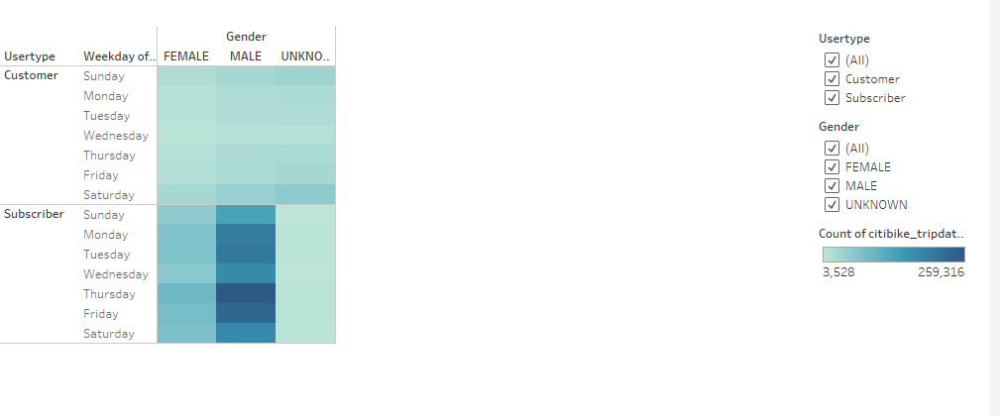

# bikesharing

## Overview of Project :

- The project aims to visualize the bike data in New York city to determine if bike-sharing is the potential business. 

## Results:

- Tableau Story: 

[link to dashboard]( https://public.tableau.com/profile/thanh.mai.khoi.nguyen#!/vizhome/NYCCitiBikeStory_16198176006680/Story1?publish=yes "Link to dashboard")  

- This graph shows that number of male checking out is higher than female and other gender.

- It shows that 7-9AM and 5-7PM on weekdays and 10AM-5PM on weekend are periods of time that people are likely to go on a bike and number of male bikers is still higher than other two. 

- This dashboard shows that young adult are likely to bike than elderly. The graph below indicates the location that people tend to bike in New York city. 

- Both of the charts show clearly the time that people tend to go biking which is still 7-9AM and 5-7PM on weekdays and 10AM-5PM on weekend.

- Number of male bikers still highest among genders even in multiple criteria such as usertype or on weekday/weekday.

## Summary :

- There is high amount of people participating in the bike sharing service, especially in different specific timeline. Mostly male is taking part in riding bike. People might use it to go to work on weekdays to replace the personal vehicle, and for exercise on weekend. 

- Two recommendation for bike-sharing:

  * We should visualize the weather to examine if it affects people going on a bike.
  * We might examine which route that people are likely to bike, especially on the weekend, so that we will determine where the bike sharing service will be located.
